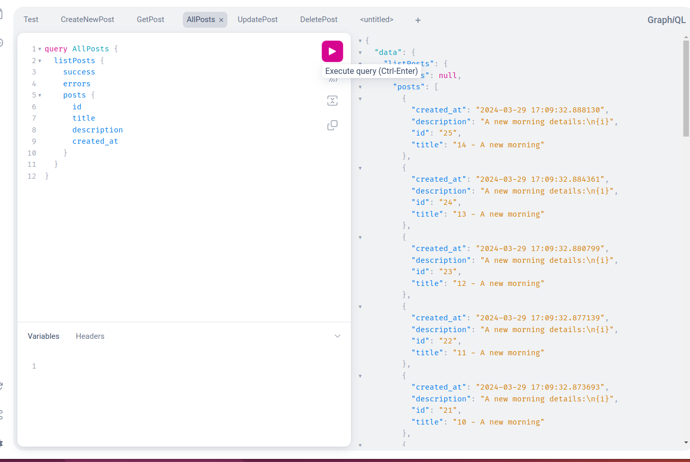

### GraphQL tutorial

[ariadne]: https://ariadnegraphql.org/
[Python graphql tutorial]: https://www.apollographql.com/blog/complete-api-guide
[Resolvers]: https://ariadnegraphql.org/docs/resolvers
[Flask integration]: https://ariadnegraphql.org/docs/flask-integration


A simple GraphQL API application built using **ariadne** and **Flask**. This is based on the original [Python graphql tutorial]

It consists of:

* A Flask API application running graphql
* A postgresql database 


It runs locally via docker compose:
```
docker compose -f compose.yaml watch
```

The above will watch for changes to **schema.graphql** and rebuilds the API container.

To view the logs for the api container in separate container:
```
docker logs -t <id/name of api container>
```


To create some seed data:
```
source .env

python seed_db.py
```

Navigate to browser to **http://localhost:8000/graphql**




To create a new post using the createPost mutation:
```
mutation CreateNewPost {
  createPost(
    input: {title: "TEST", description: "HHHH"}) {
    post {
      id
      title
      description
    }
    success
    errors
  }
}
```

To update post using updatePost mutation:
```
mutation UpdatePost {
  updatePost(
    id:"1", 
    input: {
      title:"Updated title", 
      description:"Updated description"}
  ) {
    post {
      id
      title
      description
    }
    success
    errors
  }
}
```

To delete post via deletePost mutation:
```
mutation DeletePost {
  deletePost(id:"1") {
    post {
      id
      title
      description
    }
    success
    errors
  }
}
```

To get the post via getPost query:
```
query getPost {
  getPost(id: "8") {
    post {
      id
      title
      description
    }
    success
    errors
  }
}
```

To get all posts via listPost query:
```
query AllPosts {
  listPosts {
    success
    errors
    posts {
      id
      title 
      description
      created_at
    }
  }
}
```


To make a query using CLI via curl, need to set the content type header to application/json:
```
curl -X POST \
  -H "Content-Type: application/json" \
  --data '{ "query": "{ listPosts { posts { id title description created_at } } }" }' \
  http://localhost:8000/graphql | jq '.data.listPosts.posts'
```

To pass parameters in the curl request:
```
curl -X POST \
  -H "Content-Type: application/json" \
  --data '{ "query": "{ getPost(id: \"8\") { post { id title description created_at } success errors } }" }' http://localhost:8000/graphql
```


#### Docs
- [ariadne]
- [Python graphql tutorial]
- [Resolvers]
- [Flask integration]


#### TODO:

* The current queries are made via the graphql query editor.

How to make query via curl??

```
curl http://localhost:8080/ \
-F operations='{ "query":"mutation ($userid: String!, $file: Upload!) { uploadUserAvatar(userid: $userid, file: $file) }","variables": { "file": null, "userid": null } }' \
-F map='{ "0": ["variables.file"], "1": ["variables.userid"] }' \
-F 0=@etiqueta_LG.jpeg \
-F 1=abc1234
```*